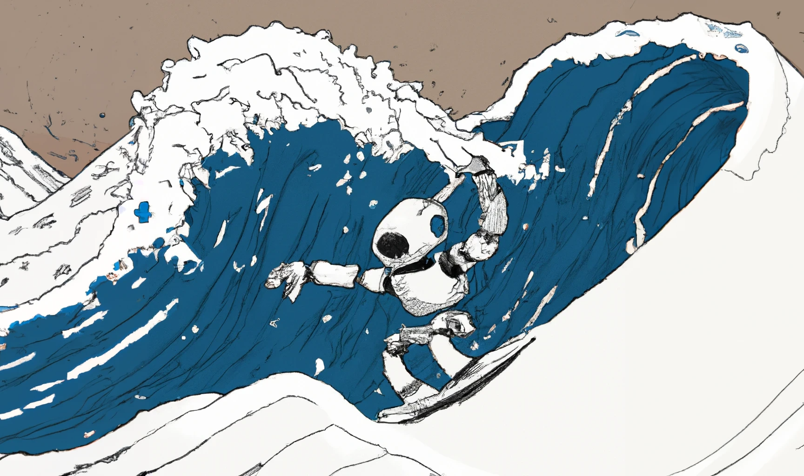
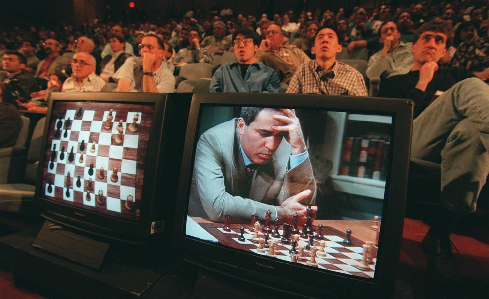
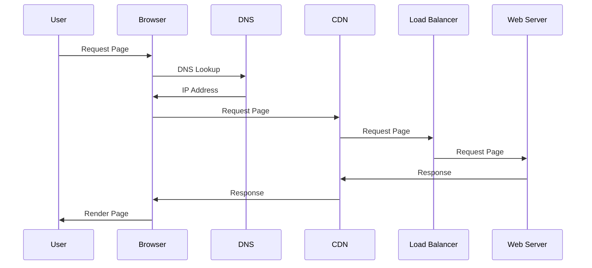

### Intro

Many of today's headlines are dominated by Artificial Intelligence (AI) and ChatGPT. The last few months have represented a clear sea change in public belief in the power of the large language model (LLM).

I'll share some of my own experiments and where I believe this technology is going.

---

### Sea change

> sea change  (idiom): a complete transformation, a radical change of direction in attitude, goals . . . (Grammarist) [1]

Last month, ChatGPT passed 100m monthly users.

I believe the cultural sea change is upon us.

I had been playing with GPT for a few months and was a finalist in an internal hackday called Slackday. I released the most basic version of SlackGPT (and Slack is a natural interface for text based interactions with LLMs, evidenced by OpenAI's announcement).

The question on my mind has been how it will impact the nature of work.

- Will we use AI to eliminate jobs (or types of jobs)?
- Will we use AI to create new and more interesting job opportunities?

Both. We will inevitably not only automate certain tasks, but also increase creativity and problem-solving abilities.

As a former researcher in human-computer interaction, I've always been interested in the ways that technology can enhance our abilities (e.g. with an iPhone I no longer have to remember phone numbers).

---

### Centaur Chess

One field to look at is the progression of chess over the last few decades and its integration with computer collaborators.

In the past, chess was a purely human game, with players relying on their own strategy and tactics to win. However, with the advent of computer chess engines, the game has evolved into what is known as "centaur chess." In centaur chess, human players team up with computer engines to analyze outcomes, resulting in a new and unconventional way of playing the game.

In 1997, IBM's supercomputer Deep Blue famously beat world chess champion Garry Kasparov in six games. Starting in 1998, Kasparov founded ["Advanced" chess tournaments](https://historyofinformation.com/detail.php?entryid=4724) centered on human-computer teams playing chess against each other (also called freestyle chess).

I find this space fascinating to study how human experts and human amateurs collaborate and evolve how they work with AI. Particularly, counter-intuitive outcomes like match-ups of amateurs with lower-end chess software beating grand masters with high-end chess software, in this [example from 2005](https://en.chessbase.com/post/dark-horse-zacks-wins-freestyle-che-tournament).

> a team of amateur chess players from New Hampshire—Steven Crampton (Elo rating of 1685, which is a method for rating chess players) and Zackary Stephen (1398)—paired with three chess programs (Fritz, Shredder, and Junior and Chess Tiger) to convincingly defeat a series a teams made up of chess grandmasters (often 2500+) and some of the world’s best chess programs.

The full play-by-play can be found in the link. In individual measurements, the amateur group seemed to be the underdog in Chess Elo (players on average had 1000 fewer Elo points) and AI (both hardware and software were inferior). Yet, the amateur group prevailed - potentially due to their efficacy on using AI.

Magnus Carlsen, the current world chess champion, has spoken about how he uses AI in his own chess practice, saying that it "opens up new avenues for analyzing games and potential outcomes." This is just one example of how AI can be used to augment human abilities rather than replacing them.

I believe these patterns extend beyond just chess. As AI continues to advance, it has the potential to fundamentally change the way we work, not just by automating certain tasks but by providing us with new and innovative ways of thinking about and approaching problems.

### Code generation

Here's how I've used ChatGPT through Slack to start structuring ideas. The direct output is not perfect, but often a useful starting point for code, ideas, and projects.

- 1️⃣ Take code to generate documentation
- 2️⃣ Take a list of ingredients to generate a recipe
- 3️⃣ Take a concept to generate a sequence diagram
- 4️⃣ Take a list of exercises and generate a training program

| Read code → documentation                                                                                                                                                                                                                                                        | Read ingredients → recipe                                                                                                                                                                                                                                | Take concept → diagram                                                                                                                                                                                                                                            | Take exercises → workouts                                                                                                                                                                                                                                 |
| -------------------------------------------------------------------------------------------------------------------------------------------------------------------------------------------------------------------------------------------------------------------------------- | -------------------------------------------------------------------------------------------------------------------------------------------------------------------------------------------------------------------------------------------------------- | ----------------------------------------------------------------------------------------------------------------------------------------------------------------------------------------------------------------------------------------------------------------- | --------------------------------------------------------------------------------------------------------------------------------------------------------------------------------------------------------------------------------------------------------- |
|  |  |  |  |

This is the diagram generated from the dialog in example 3️⃣—describing a high level diagram for what happens when a person visits a website.

### Next steps

So how might we use technologies like ChatGPT to increase leverage and creativity in your day-to-day life?

Just like chess players. Find ways for specific analysis and generation of ideas.

In the next months I plan to build and play with LLMs to generate code (for engineering productivity).

Yann LeCun has this excellent model (shown above) to describe [this phenomena](https://twitter.com/ylecun/status/1625127902890151943). "Why do LLMs appear much better at generating code than generating general text? Because, unlike the real world, the universe that a program manipulates (the state of the variables) is limited, discrete, deterministic, and fully observable. The real world is none of that"

